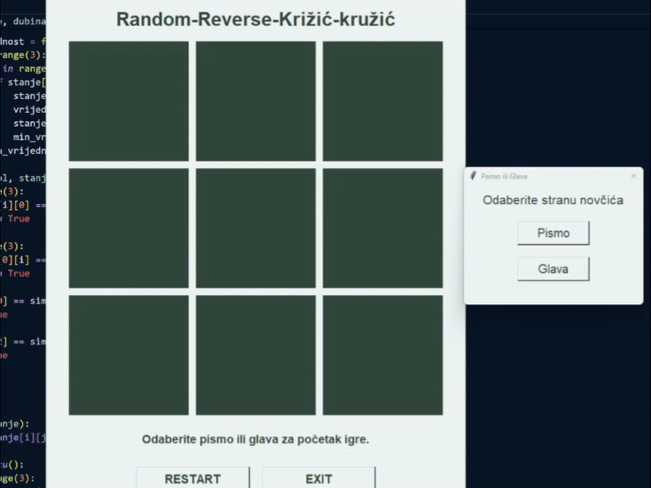

# 🎲 Random - Reverse TicTacToe Game

University project for the **Introduction to Artificial Intelligence** course.  
This is a reverse tic-tac-toe game where the goal is **_not_** to connect three in a row.  
You're playing against an AI opponent powered by the **Minimax algorithm** with a twist of randomness.

&nbsp;

## 📽️ Demo

<p align="center">
  
</p>

&nbsp;

## 🧠 Project Description

The goal of this project was to simulate intelligent behavior in a turn-based game using the Minimax algorithm.
But with a twist: unlike classic tic-tac-toe, forming three in a row means you lose.

🪙 At the beginning of the game, the player chooses heads or tails
🎯 Before each turn, a coin is flipped — if it lands on the player’s chosen side, they get to play that move
🧠 The AI uses Minimax logic to try and force the player into creating a losing line
🎲 The coin-flip mechanic introduces randomness, making each match more unpredictable and strategic

This project demonstrates:
- Basic game logic implementation using Python and `tkinter`
- Application of the **Minimax algorithm** for AI decision-making
- GUI interaction and turn-based mechanics
- Game deployment via `.exe` for Windows systems

&nbsp;

## 🧰 Tools & Libraries Used

- `tkinter` – for building the graphical interface  
- `random` – to simulate dice rolls and game unpredictability
- `pyinstaller` – to generate `.exe` file

&nbsp;

## 📁 File Structure

```
reverse-tictactoe-ai/
│
├── main.py                    # Game source code
├── RandomReverseTicTacToe.exe # Windows executable
├── media/
│   └── game_demo.gif          # Gameplay preview GIF
└── README.md
```

&nbsp;

## 🎓 Academic Context

This project was created as part of coursework for the **Introduction to Artificial Intelligence** subject.  
It serves as a basic example of how game theory and decision-making algorithms can be applied to simple games.

It is not meant for production use or reuse, but rather as an academic demonstration of algorithmic thinking and practical implementation.
